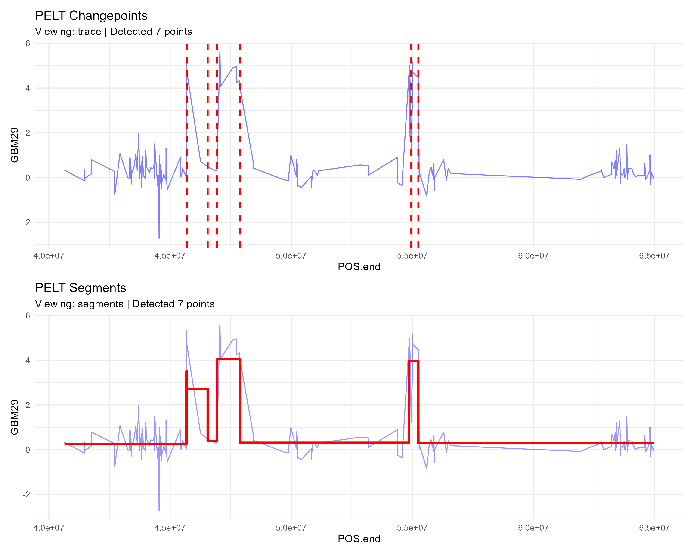
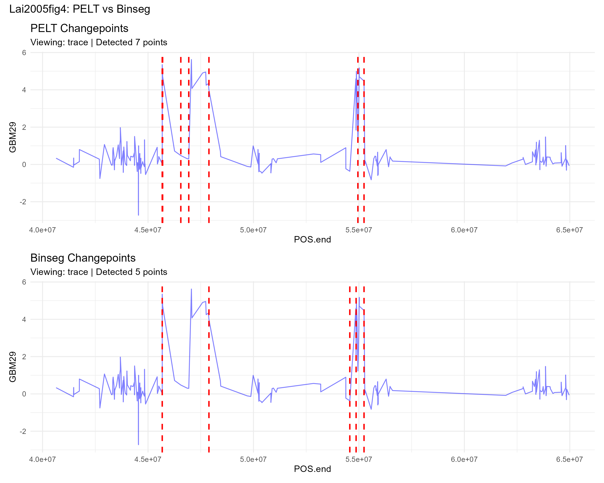
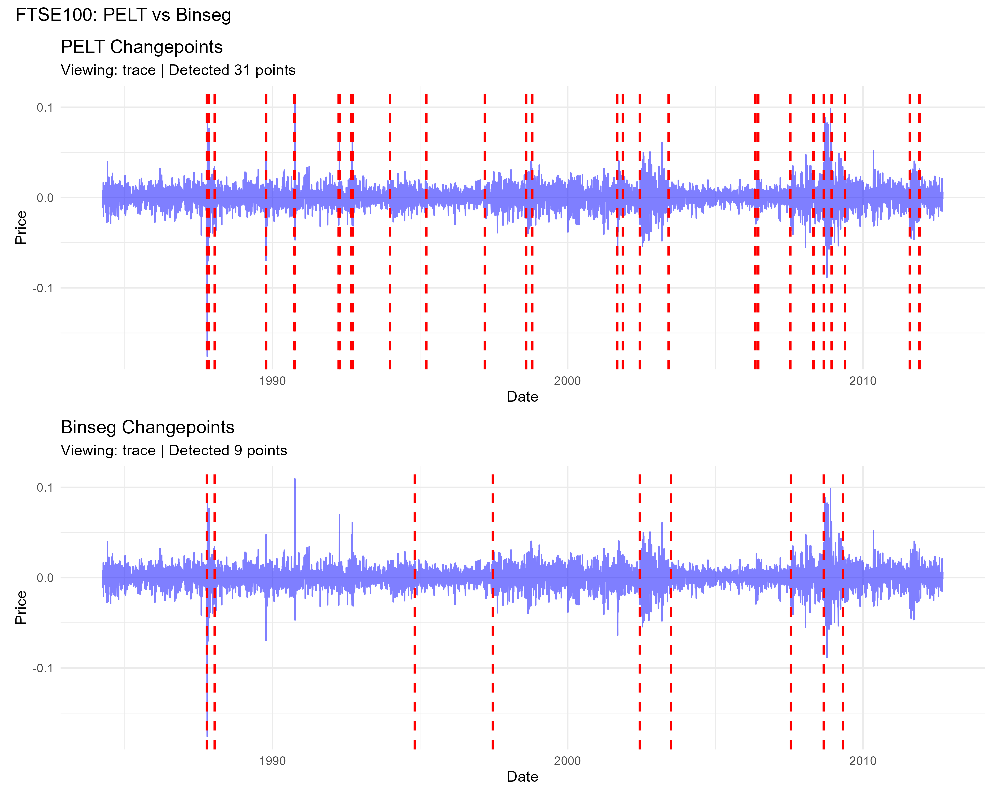
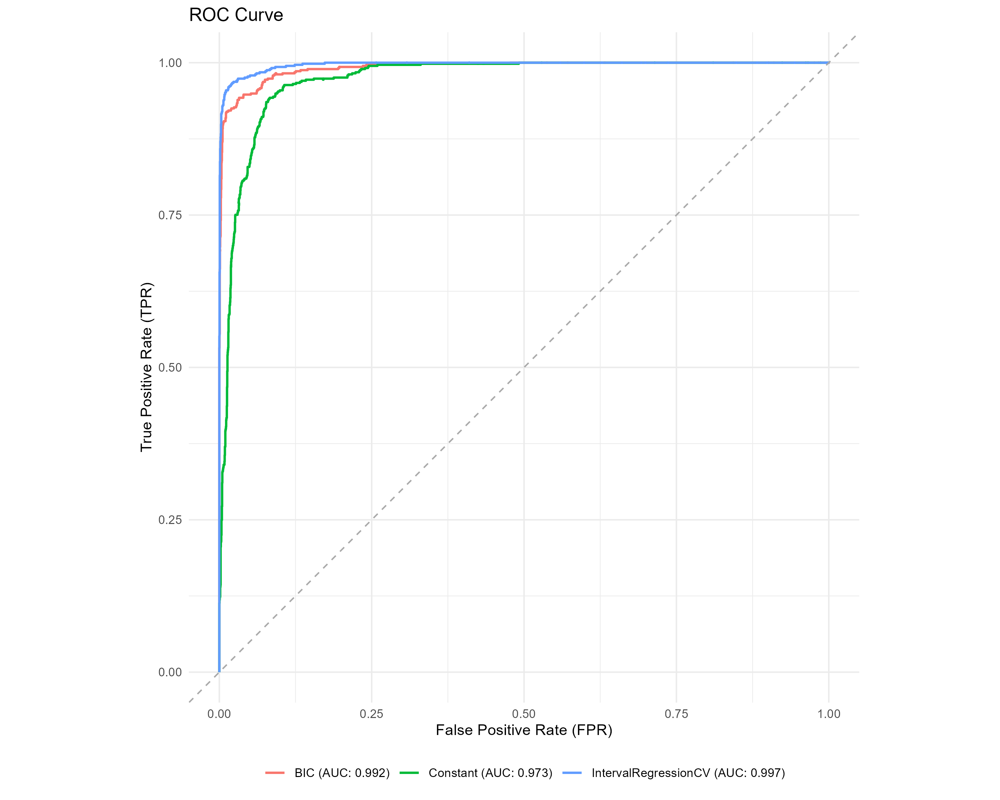

# mlr3changepoint - Google Summer of Code 2026

Welcome. Thank you for taking the time to evaluate this submission for the `mlr3changepoint` project. 

This repository contains the architecture, test scripts, and full documentation to integrate changepoint detection capabilities into the `mlr3` ecosystem.

## Full Report

For the complete technical breakdown, including mathematical justifications, architectural design choices, and full visualisations, please refer to the compiled PDF report:

**[`tests/solutions.pdf`](tests/solutions.pdf)** (Generated from `tests/solutions.Rmd`)

## File Structure

Below is an overview of the key components in this repository:

```text
mlr3changepoint/
├── R/                          # R6 class definitions and autoplot methods
│   ├── LearnerCpt.R            # Base Learner wrapper for changepoint algorithms
│   ├── LearnerIntRegrCV.R      # Specialised learner for Interval Regression
│   ├── TaskCptUnsupervised.R   # Unsupervised task for sequential data
│   ├── TaskInterval.R          # Supervised task explicitly handling interval margins
│   ├── PredictionCpt.R         # Standardised prediction return object
│   └── autoplot.R              # ggplot2/mlr3viz extension for sequence rendering
├── tests/                      # Testing scripts and final reporting
│   ├── easy.R                  # Implementation for the Easy test
│   ├── medium.R                # Implementation for the Medium test
│   ├── hard.R                  # Implementation for the Hard test
│   ├── solutions.Rmd           # Rmarkdown source for the report
│   ├── solutions.pdf           # *FULL DETAILED REPORT* 
│   └── references.bib          # Academic references for the report
├── DESCRIPTION                 # R package metadata
└── NAMESPACE                   # Exported classes and functions
```

## Summary of Tests & Results

The evaluation is broken down into three primary tasks, progressively shifting from basic wrappers to advanced predictive penalty learning. All implementation details are unified under the `mlr3` object-oriented R6 structure.

### Easy Test
*   **Objective:** Run `changepoint` or `binsegRcpp` on a dataset and plot the results.
*   **Approach:** Wrapped `changepoint::cpt.meanvar` (using the Pruned Exact Linear Time or **PELT** method) inside a newly defined `TaskCptUnsupervised` / `LearnerCpt` pipeline. Tested on the `Lai2005fig4` genomic dataset. Created custom `autoplot` methods (`trace` and `segments`).
*   **Result:** The package flawlessly executed the subsetting and training, successfully clustering the data into logical segments and identifying 7 structural breaks.

<p align="center">
  
</p>

### Medium Test
*   **Objective:** Run two different algorithms on two datasets and visualise the differences.
*   **Approach:** Wrapped a second algorithm, **Binary Segmentation** (`binsegRcpp::binseg`). Evaluated both algorithms against `Lai2005fig4` (clear signal) and `ftse100` (volatile financial data), using strictly equivalent **BIC** penalties for fairness.
*   **Result:** On clean genomic data, both returned identical breakpoints. However, the volatile financial dataset heavily exposed their operational differences:

| Algorithm | Lai2005fig4 Breaks | FTSE100 Breaks |
| :--- | :---: | :---: |
| **PELT** | 7 | 31 |
| **Binary Segmentation** | 7 | 9 |

<p align="center">
  
  
</p>

### Hard Test
*   **Objective:** Set up an interval regression task, run cross-validation, and compute evaluation metrics for predicting the optimal penalty.
*   **Approach:** Instead of relying on a rigid baseline like BIC ($\log(n)$), I implemented a modern supervised machine learning approach using `penaltyLearning::IntervalRegressionCV`. To bypass `mlr3`'s native limitations regarding paired targets, I engineered a specialised `TaskInterval` class. Validation was done via a 5-Fold CV using a custom `msr("time_train")` metric to sidestep bounds-checking errors.
*   **Result:** The Interval Regression approach drastically outperformed static heuristics, showcasing the structural superiority of predictive penalty intervals:

| Method | ROC AUC |
| :--- | :---: |
| **Interval Regression CV** | **0.997** |
| BIC Baseline | 0.992 |
| Constant Penalty Baseline | 0.973 |

<p align="center">
  
</p>

---

Please see **[`tests/solutions.pdf`](tests/solutions.pdf)** to review the exact code, resulting figures, and extensive written explanations for this implementation.