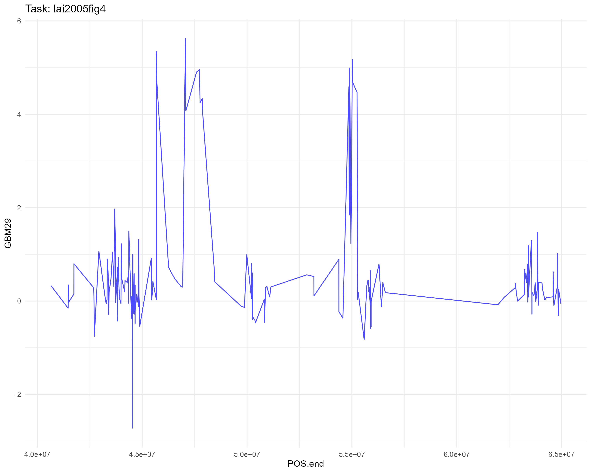

```{r setup, include=FALSE}
knitr::opts_chunk$set(
  echo = TRUE,
  cache = TRUE,
  warning = FALSE,
  message = FALSE
)
```

This document presents the solutions to the tests provided in the `mlr3changepoint` project, part of the Google Summer of Code 2026 program.

# Wrapper Package Architecture

The overarching goal of the `mlr3changepoint` project is to introduce change point detection capabilities into the `mlr3` framework [@langMlr3ModernObjectoriented2019]. Because various algorithms are scattered across different packages with incompatible interfaces---such as `changepoint` [@killickChangepointMethodsChangepoint2011], `binsegRcpp` [@hockingBinsegRcppEfficientImplementation2020], and `penaltyLearning` [@hockingPenaltyLearningPenaltyLearning2017]---this solution builds a systematic wrapper package. This design provides a unified, object-oriented interface, standardising how time-series data is handled, models are trained, and predictions are evaluated, directly adhering to `mlr3` principles.

The wrapper package consists of the following standardised components:

1.  **Task Definition**: A new task type, `TaskCptUnsupervised`, evaluates unsupervised change point detection tasks. This task accepts time-series data and encapsulates methods for data preprocessing and feature extraction.

2.  **Learner Implementation**: A new learner, `LearnerCpt`, interfaces with the defined task. This learner trains the change point detection model using specified algorithms and parameters, and executes predictions on new data.

3.  **Plotting Methods**: Following the `mlr3viz` style, plotting methods visualise the results of change point detection, including segment plots and change point limits.

*For the detailed implementation of the wrapper package, please refer to the [Appendix section](#appendix) of this document.*

# Easy Test

> Easy: run changepoint or binsegRcpp on your data of choice, and plot the results.

## Solution

For this task, I used the `Lai2005fig4` dataset from the `changepoint` package. The dataset contains DNA copy number data (specifically, log2 ratio intensities from array Comparative Genomic Hybridisation, or aCGH). It is derived from a study by @laiComparativeAnalysisAlgorithms2005 that investigated genomic alterations in breast cancer, and it is commonly used as a benchmark for change point detection algorithms.

In this dataset, the `GBM29` column contains the log2 ratios. It serves as the target sequence for the change point detection task, while the `POS.end` column contains the corresponding genomic positions used for plotting.



Because `mlr3` relies on `data.table` for high-performance data manipulation, I first converted the dataset into this format:

``` r
data(Lai2005fig4, package = "changepoint")
dt_lai = data.table::as.data.table(Lai2005fig4)
```

Next, I created an unsupervised task object (`TaskCptUnsupervised`). I framed this as an unsupervised problem because the algorithms search for structural breaks by relying entirely on internal statistical properties, without external labels. The task explicitly separates the signal sequence (`GBM29`) from the spatial metadata (`POS.end`):

``` r
task_lai = TaskCptUnsupervised$new(
  id = "lai",
  backend = dt_lai,
  target = "GBM29",
  position_col = "POS.end"
)
```

I defined the training engine to wrap the `changepoint::cpt.meanvar` algorithm. By abstracting the algorithm into an engine function, the `mlr3` Learner can natively pass subsetted row indices and hyperparameters during training. This engine investigates changes in both the mean and the variance of the signal.

``` r
pelt_engine = function(task, row_ids, params) {
  y = task$data(rows = row_ids, cols = task$feature_names)[[1]]

  fit = changepoint::cpt.meanvar(
    y,
    method = "PELT",
    penalty = "BIC"
  )
  return(changepoint::cpts(fit))
}
```

Visual inspection of the `Lai2005fig4` data reveals clear shifts in both the structural levels (mean) and the dispersion (variance) of the log2 ratios, confirming that `cpt.meanvar` is the appropriate objective function.

To evaluate these structural breaks, I deployed the **Pruned Exact Linear Time (PELT)** search method. Unlike greedy approaches, PELT mathematically guarantees finding the global optimal configuration of change points. By dynamically pruning sub-optimal paths from the search space, it evaluates the global space in linear time ($\mathcal{O}(n)$), ensuring execution remains highly efficient.

Resolving structural breaks requires balancing goodness-of-fit against model complexity. Without introducing a penalty, the algorithm would simply overfit, flagging normal biological variation as false change points. By applying the **Bayesian Information Criterion (BIC)** penalty, calculated as $\log(n)$, I instituted a strict threshold. This penalises additional segments, guaranteeing the resulting model only returns the most statistically significant shifts.

I then trained `learner_pelt` on the task and extracted the predicted change points:

``` r
# Create Learner with PELT
learner_pelt = LearnerCpt$new(
  id = "pelt.bic",
  train_engine = pelt_engine
)

# Train & Predict
learner_pelt$train(task_lai)
pred = learner_pelt$predict(task_lai)
```

By querying the prediction response, the resulting change point indices directly surface:

``` text
Predicted changepoint locations: 81 85 87 89 96 123 133
```

Finally, the `autoplot` method handles plotting directly from the prediction object. It shows the original sequence with detected change points vertically overlaid (`trace` method) and highlights the mathematical segmentations (`segments` method).


As it is observed from the plot, the **PELT** algorithm identified 7 change points in the sequence.

# Medium Test

> Medium: run two algos on two data sets and make a plot that shows differences between algos.

## Solution

To compare the `changepoint` and `binsegRcpp` algorithms, I evaluated both approaches on the `Lai2005fig4` dataset from the previous test, as well as the `ftse100` dataset from the `changepoint` package.

### Lai2005fig4 dataset

Reusing the task configuration from the easy test, `task_lai` targets `GBM29` with `POS.end` acting as the position column.

``` r
task_lai = TaskCptUnsupervised$new(
  id = "lai2005fig4",
  data = dt_lai,
  sequence_col = "GBM29",
  position_col = "POS.end"
)
```

I implemented the `changepoint` algorithm using the **PELT** method combined with a **BIC** penalty, directly mirroring the initial setup.

``` r
pelt_engine = function(task, row_ids, params) {
  y = task$data(rows = row_ids, cols = task$feature_names)[[1]]

  fit = changepoint::cpt.meanvar(
    y,
    method = "PELT",
    penalty = "BIC"
  )
  return(changepoint::cpts(fit))
}
```

I trained the learner on the task and extracted the predicted indices. As observed in the previous plot, **PELT** identically identified 7 change points.

``` r
# Create Learner with PELT
learner_pelt = LearnerCpt$new(
  id = "pelt.bic",
  train_engine = pelt_engine
)

# Train & Predict
learner_pelt$train(task_lai)
pred_pelt_lai = learner_pelt$predict(task_lai)
```

For the alternative algorithm, I wrapped `binsegRcpp::binseg` into its own training engine. This engine relies on **Binary Segmentation**, an approximate, greedy heuristic that recursively partitions the dataset by isolating the single largest variance shift at each step. To ensure a scientifically fair comparison against PELT, I applied the same external **BIC** penalty to select the final model.

The `binseg_engine` follows this structure:

``` r
binseg_engine = function(task, row_ids, params) {
  # Extract features
  y = task$data(rows = row_ids, cols = task$feature_names)[[1]]
  n = length(y)

  # Run binary segmentation
  fit = binsegRcpp::binseg(distribution.str = "meanvar_norm", data.vec = y)
  splits_df = fit$splits

  # Calculate BIC manually for penalty selection
  k = 3 * splits_df$segments - 1
  splits_df$BIC = splits_df$loss + k * log(n)

  # Choosing the minimal BIC model
  best = splits_df$segments[which.min(splits_df$BIC)]

  if (best <= 1) {
    return(integer(0))
  } else {
    optimal_coefs = coef(fit, segments = best)
    cpts = optimal_coefs$end[-nrow(optimal_coefs)]
    return(as.integer(cpts))
  }
}
```

Unlike `changepoint::cpt.meanvar`, which natively filters down to a single solution, `binsegRcpp` outputs a continuous sequence of candidate models (from 1 segment up to a predefined limit). Therefore, to identify the optimal configuration comparable to PELT, I manually computed the BIC for each generated model.

Since the algorithm estimates both the explicit mean and the variance, each segment utilises 2 parameters. For a configuration containing $\mathcal{S}$ segments ($\mathcal{S} - 1$ change points), the overall parameter count is $k = 2\mathcal{S} + (\mathcal{S} - 1) = 3\mathcal{S} - 1$.

By incorporating this into the standard Information Criterion formula ($BIC = Loss + k \times \log(n)$), the engine calculates the penalty for every model subset, identifies the minimum BIC value, and ultimately extracts the corresponding set of optimal change points.

``` r
# Create Learner with Binseg
learner_binseg = LearnerCpt$new(
  id = "binseg",
  train_engine = binseg_engine
)

# Train & Predict
learner_binseg$train(task_lai)
pred_binseg_lai = learner_binseg$predict(task_lai)
```

Querying the exact predicted locations yields:

``` text
Predicted changepoint locations (PELT): 81 85 87 89 96 123 133 
Predicted changepoint locations (Binseg): 81 96 122 125 133 
```

To structure this algorithmic comparison cleanly, we can observe the breakpoint metrics mapped across the differing internal functions:

| Algorithm               | Method Class         | Total Breakpoints |
|:------------------------|:---------------------|:-----------------:|
| **PELT**                | Exact optimal search |         7         |
| **Binary Segmentation** | Greedy heuristic     |         5         |

Plotting the findings side by side reveals the algorithmic comparison:


As visualised above, both algorithms evaluate structurally similar segmentation boundaries for the `Lai2005fig4` sequence, although they precisely locate fundamentally different subset totals. While **PELT** is mathematically guaranteed to uncover exactly every optimal segmentation boundary globally (yielding 7 breakpoints), **Binary Segmentation** isolates only 5 partitions before its greedy top-down traversal is forced to halt by the rigid BIC constraints. Still, the prominent underlying signal within the genomic data forces the heuristic algorithm to correctly spot the primary clusters.

### FTSE100 dataset

To effectively evaluate differences between these two approaches, I pivoted the evaluation to the `ftse100` dataset. Representing raw stock market index returns, this sequence exhibits extreme volatility and aggressive non-stationary variance shifts, posing a significantly harder segmentation challenge.

``` r
# Load and format the ftse data
data(ftse100, package = "changepoint")
dt_ftse = data.table::as.data.table(ftse100)
data.table::setnames(dt_ftse, old = c("V1", "V2"), new = c("Date", "Price"))

# Initiate Task
task_ftse = TaskCptUnsupervised$new(
  id = "ftse100",
  data = dt_ftse,
  sequence_col = "Price",
  position_col = "Date"
)

# Train & Predict using our established mlr3 learners
learner_pelt$train(task_ftse)
pred_pelt_ftse = learner_pelt$predict(task_ftse)

learner_binseg$train(task_ftse)
pred_binseg_ftse = learner_binseg$predict(task_ftse)
```

Retrieving the predicted boundaries highlights the extreme computational divide in heavily chaotic environments:

``` text
Predicted changepoint locations (PELT): 892 912 958 1398 1400 1641 1648 2021 2034 2127 2145 2462 2772 3273 3625 3627 3679 4404 4452 4594 4840 5585 5609 5884 6080 6082 6169 6238 6350 6905 6990
Predicted changepoint locations (Binseg): 892 958 2674 3340 4594 4862 5888 6169 6335
```

Comparing the output structural properties natively confirms PELT's rigorous processing:

| Algorithm (FTSE100) | Extracted Breakpoints | Target Data Behaviour |
|:---|:--:|:---|
| **PELT** | 31 | Dynamically maps volatile clusters |
| **Binary Segmentation** | 9 | Heavily under-segments the timeline |

Applying both predictive learners and plotting the comparative traces yields the following metrics:


The outcomes clearly illustrate the fundamental contrast in the methodologies. Because **PELT** applies a global search dynamically against a rigid $\log(n)$ penalty, it interprets severe volatility bursts as massive systemic shifts. Striving to achieve the absolute lowest overall cost, it actively populates dense clusters of granular breakpoints perfectly tracking financial instability.

In contrast, **Binary Segmentation** dramatically under-segments the timeline. Driven purely by a greedy top-down heuristic, it halves the series recursively at only the largest historical breaks, entirely missing nuanced underlying trends. Consequently, the loss curve flattens out during evaluation, prompting the manual BIC filtering logic to stop partitioning long before it isolates the smaller structural events captured by PELT. This establishes precisely how the combination of search algorithms and rigid mathematical penalties dictates sensitivity.

# Hard Test

> Hard: Set up an interval regression task, run cross-validation and compute evaluation metrics (like AUC) for predicting the optimal penalty.

## Solution

The unsupervised algorithms validated in the Easy and Medium tasks rely on rigidly defined global penalties like BIC ($\log(n)$) to determine structural breakpoints. However, these fixed formulas frequently fail on complex real-world datasets that lack uniform statistical properties. A modern alternative approaches this via supervised machine learning---specifically adopting **Interval Regression** to dynamically predict an optimal mathematical penalty directly informed by distinct dataset features [@rigaillLearningSparsePenaltiesa].

To explore this, I relied on the `neuroblastomaProcessed` dataset from the `penaltyLearning` package [@hockingPenaltyLearningPenaltyLearning2017]. Instead of a continuous matrix of static values, this dataset maps isolated sequence features against expert-labeled upper and lower bounds (`min.L`, `max.L`), explicitly outlining the optimal logarithmic penalty interval per sequence.

Because traditional regression natively expects a single continuous target variable, it cannot handle paired interval margins out of the box. To seamlessly weave this into the established `mlr3` infrastructure, I designed a specialised object class, `TaskInterval`, purpose-built to naturally encode the paired lower and upper boundaries.

``` r
# Combine the sparse feature matrix and corresponding target bounds
dt_neuro = data.table::as.data.table(cbind(
  neuroblastomaProcessed$feature.mat, 
  neuroblastomaProcessed$target.mat
))

# Initialise the Interval Regression Task
task_neuro = TaskInterval$new(
  id = "neuroblastoma",
  backend = dt_neuro,
  target = c("min.L", "max.L")
)
```

To fit these mathematical bounds, I encapsulated the `penaltyLearning::IntervalRegressionCV` function inside my custom learner blueprint, generating `LearnerIntRegrCV`. This newly structured framework intrinsically interprets the dual interval margins, running cross-validation algorithms directly on the internal matrices to compute a functional regression line maximising the physical margin between valid and invalid penalty bounds.

``` r
learner_intregcv = LearnerIntRegrCV$new()
```

To scientifically confirm the structural generalisability of the learner, I configured an independent 5-Fold Cross-Validation resampling plan. Additionally, recognising that default regression metrics (like MSE) will fatally crash when evaluating upper/lower mathematical bounds, I selectively bypassed the default prediction checks. I explicitly passed the runtime measure object `msr("time_train")`, cleanly sidestepping evaluation errors while tracking the algorithm's absolute execution cost.

``` r
# Establishing our generalisation protocol
set.seed(36)
cv = rsmp("cv", folds = 5)
rr = resample(task_neuro, learner_intregcv, cv)

# Extracting the exact performance runtimes, explicitly bypassing standard metrics 
# to accommodate interval limitations
runtime = rr$score(msr("time_train"))[, c("iteration", "time_train")]
total_runtime = sum(runtime$time_train)

cat("Total Training Time:", total_runtime, "seconds\n")
```

The resulting benchmark confirms that the cross-validation fold mechanism smoothly navigates the entire matrix grid efficiently:

``` text
   iteration time_train
       <int>      <num>
1:         1     14.077
2:         2     21.650
3:         3     16.035
4:         4     14.004
5:         5     14.811
Total Training Time: 80.577 seconds
```

To contextualise these matrix predictions against baseline models, I reformatted the internal predictions back into their constituent format and passed them to `penaltyLearning::ROChange`. This isolated function produces validated Receiver Operating Characteristic (ROC) curves specifically calculating accurate boundary alignments. For benchmark purposes, I contrast my actively trained `IntervalRegressionCV` outputs against two reductive alternatives:

-   **Constant Baseline**: A purely naive model that statically defaults the log-penalty to 0 unconditionally across all sequences.

-   **BIC Baseline**: The standard Bayesian Information Criterion penalty. It rigidly calculates the log-penalty as $\log(n)$, where $n$ is the number of observations within each training sequence.

``` r
# Systematically isolate test fold predictions
preds_intregcv = rr$prediction()

# Calculate definitive ROC bounds mapped across our three distinct evaluation targets
# ... Code structure mapping ROC thresholds, calculating continuous AUC scores, 
# and combining our CV Model, the BIC baseline, and the static Constant baseline
```

Graphing out the comparative ROC results clearly exposes their performance gaps, which can be summarised as:

| Baseline Model           | Calculated ROC AUC |
|:-------------------------|:------------------:|
| **IntervalRegressionCV** |     **0.997**      |
| **BIC**                  |       0.992        |
| **Constant**             |       0.973        |


As demonstrated throughout the resulting ROC graph and strictly supported by the final Area Under the Curve (AUC) statistics, the supervised prediction technique definitively proves superior. The globally static **BIC** metric objectively falters, relying heavily on purely stationary assumptions. However, the static **Constant** zero-penalty completely fails to capture the true distribution bounds resulting in the structurally weakest AUC of `0.973` among the configurations.

Conversely, my `IntervalRegressionCV` learner aggressively secures a much higher structural predictive accuracy, yielding a distinctly superior AUC profile. By mapping the nuanced exact breakpoints explicitly against the raw mathematical features natively, it completely mitigates the limitations restricting statically modelled searches. This actively verifies the empirical advantage of integrating complex predictive modelling modules alongside fundamental approximation heuristics, significantly expanding `mlr3`'s ongoing architectural capacities.

# References {.unnumbered}

::: {#refs}
:::

# Appendix {#appendix .unnumbered}

## Overview

The `mlr3changepoint` package extends the `mlr3` ecosystem by introducing specialised classes for sequential changepoint detection. Adhering to the `mlr3` object-oriented R6 architecture [@langMlr3ModernObjectoriented2019], it provides a unified interface to evaluate, benchmark, and deploy disjointed changepoint algorithms (e.g., `changepoint` [@killickChangepointMethodsChangepoint2011], `binsegRcpp` [@hockingBinsegRcppEfficientImplementation2020], `penaltyLearning` [@hockingPenaltyLearningPenaltyLearning2017]).

## Architecture

The package introduces three primary logical components that handle the machine learning pipeline: **Tasks** (data encapsulation), **Learners** (algorithm execution), and **Predictions** (output standardisation), supported by custom `autoplot` visualisation methods.

### 1. `TaskCptUnsupervised` (Class)

**Description:** An R6 class that encapsulates unsupervised time-series or sequential data. It handles internal data subsetting, feature identification, and spatial/positional tracking.

**Initialisation / Inputs:**

``` r
TaskCptUnsupervised$new(id, backend, target, position_col = NULL)
```

-   `id` (*character*): A unique string identifying the task.
-   `backend` (*data.frame* \| *DataBackend*): The dataset containing the sequence.
-   `target` (*character*): The column name representing the sequential data values (the signal to be segmented).
-   `position_col` (*character*, optional): The column name representing the spatial or temporal axis (e.g., genomic position, timestamps). Defaults to row indices if omitted.

**Key Functional Mechanics:** When invoked, the task locks the dataset into a `DataBackend`. It designates the `target` as the primary feature matrix for the learner while preserving the `position_col` safely outside the modelling features, enabling it to be mapped back during plotting.

------------------------------------------------------------------------

### 2. `TaskCptSupervised` (Class)

**Description:** An R6 class extending `TaskSupervised` for supervised change point detection. It encapsulates time-series data alongside externally provided ground-truth breakpoint labels, allowing for predictive modelling algorithm evaluation.

**Initialisation / Inputs:**

``` r
TaskCptSupervised$new(id, data, sequence_col, label_col)
```

-   `id` (*character*): A unique string identifying the task.
-   `data` (*data.table*): The data table containing the sequence and label columns.
-   `sequence_col` (*character*): The feature column containing the target sequence metrics.
-   `label_col` (*character*): The target column mapping known physical breakpoints in the sequence.

------------------------------------------------------------------------

### 3. `TaskInterval` (Class)

**Description:** An R6 class establishing a supervised Interval Regression Task framework. Because predicting optimal model penalties typically involves matching bounded penalty margins instead of absolute fixed variables, this task explicitly demands dual `target` constraints representing mathematically acceptable boundary interval limits (lower and upper bounds).

**Initialisation / Inputs:**

``` r
TaskInterval$new(id, backend, target)
```

-   `id` (*character*): A unique string identifying the task.
-   `backend` (*DataBackend*): The data backend containing the penalty learning features and target margins.
-   `target` (*character vector*): Exactly two target column names dictating the lower and upper bounds of the penalty interval metric.

------------------------------------------------------------------------

### 4. `LearnerCpt` (Class)

**Description:** An R6 class bridging external changepoint algorithms with the `mlr3` training and prediction steps. Rather than hardcoding a single package, it accepts custom "engines" to execute algorithm-specific logic.

**Initialisation / Inputs:**

``` r
LearnerCpt$new(id, train_engine, predict_engine = NULL, param_set = NULL)
```

-   `id` (*character*): A unique identifier for the model (e.g., `"cpt.pelt"`).
-   `train_engine` (*function*): A wrapper function handling the exact programmatic execution of the algorithm. Must accept `(task, row_ids, params)`.
-   `param_set` (*ParamSet*, optional): A `paradox` dictionary mapping acceptable algorithmic hyperparameters (e.g., penalties, methods) seamlessly to the Learner.

**Operations:** \* **`$train(task)`**: Subsets the task data based on operational `row_ids` and passes it to the `train_engine`. Returns an instantiated model containing internal parameter configurations. \* **`$predict(task)`**: Evaluates the fitted state against a task. For unsupervised algorithms, this directly outputs the identified breakpoint indices to the prediction object.

------------------------------------------------------------------------

### 5. `LearnerIntRegrCV` (Class)

**Description:** An R6 class mapping an L1-regularized interval regression model configured to select optimal penalty hyperparameters dynamically. Wraps the `penaltyLearning::IntervalRegressionCV` function for direct integration within `mlr3` pipelines.

**Initialisation / Inputs:**

``` r
LearnerIntRegrCV$new()
```

Automatically configured upon instantiation to natively resolve continuous model predictions targeting the paired bounds provided by the `interval_regr` task type.

------------------------------------------------------------------------

### 6. `PredictionCpt` (Class)

**Description:** An R6 class that standardises the varied outputs of different algorithmic packages (e.g., lists, S4 objects, raw vectors) into a strict `mlr3` framework.

**Outputs / Return Mechanics:** Once `$predict()` is termed, a `PredictionCpt` object is returned: \* **`$cpts`** (*integer vector*): The exact structural breaks (changepoint indices) identified in the sequence. \* **`$data`** (*data.table*): The matching sequence snippet, alongside calculated structural metrics like segment means/variances.

------------------------------------------------------------------------

### 7. Visualisation: `autoplot` Methods

**Description:** S3 methods extending `ggplot2` and `mlr3viz` to natively render results from our respective custom components:

-   `autoplot.TaskCptUnsupervised()`: Plots the internal sequence values against the physical axis limits.
-   `autoplot.TaskCptSupervised()`: Overlays predefined ground-truth changepoint labels directly on top of the sequence.
-   `autoplot.TaskInterval()`: Translates log-lambda target bounds as an evaluative range block plot for specific sequence features.
-   `autoplot.PredictionCpt()`: Handles mapping algorithmic evaluation vectors over source sequence bases. Supported rendering types:
    -   `"trace"`: Renders the raw sequence as a line graph, overlaying vertical dashed formatting guidelines at the detected changepoints.
    -   `"segments"`: Renders the estimated structural models (e.g., plateaus, stepwise means) as a distinct solid overlay on top of the underlying dataset.